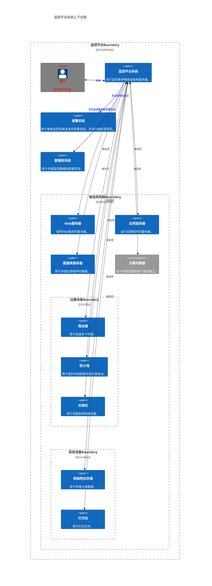

```mermaid
    C4Context
      title 监控平台系统上下文图
      Enterprise_Boundary(b0, "监控平台Boundary") {
        Person(User, "用户", "系统的使用者")
        System(MonitoringSystem, "监控平台系统", "用于监控各种网络设备和服务器。")
        System(AlertingSystem, "报警系统", "用于接收监控系统发来的告警信息，并及时通知管理员。")
        System(DatabaseSystem, "数据库系统", "用于存储监控数据和配置信息。")

        Enterprise_Boundary(b1, "被监控系统Boundary") {

          System(WebServer, "Web服务器", "提供Web服务的服务器。")
          System(AppServer, "应用服务器", "运行应用程序的服务器。")
          System(DbServer, "数据库服务器", "用于存储应用程序的数据。")

          System_Boundary(b2, "边缘设备Boundary") {
            System(Router, "路由器", "用于连接多个网络。")
            System(Firewall, "防火墙", "用于保护内部网络免受外部攻击。")
            System(Switch, "交换机", "用于连接各种网络设备。")
          }

          System_Ext(LoadBalancer, "负载均衡器", "用于分配流量到多个服务器上。")

          Boundary(b3, "其他设备Boundary", "boundary") {
            System(NAS, "网络附加存储", "用于存储大量数据。")
            System(Printer, "打印机", "用于打印文件。")
          }
        }
      }

      BiRel(User, MonitoringSystem, "使用")
      Rel(MonitoringSystem, AlertingSystem, "发送告警信息到")
      Rel(MonitoringSystem, DatabaseSystem, "读写监控数据和配置信息")

      BiRel(WebServer, MonitoringSystem, "被监控")
      BiRel(AppServer, MonitoringSystem, "被监控")
      BiRel(DbServer, MonitoringSystem, "被监控")
      BiRel(Router, MonitoringSystem, "被监控")
      BiRel(Firewall, MonitoringSystem, "被监控")
      BiRel(Switch, MonitoringSystem, "被监控")
      BiRel(LoadBalancer, MonitoringSystem, "被监控")
      BiRel(NAS, MonitoringSystem, "被监控")
      BiRel(Printer, MonitoringSystem, "被监控")

      UpdateElementStyle(User, $fontColor="red", $bgColor="grey", $borderColor="red")
      UpdateRelStyle(User, MonitoringSystem, $textColor="blue", $lineColor="blue", $offsetX="5")
      UpdateRelStyle(MonitoringSystem, AlertingSystem, $textColor="blue", $lineColor="blue", $offsetY="-10")
      UpdateRelStyle(MonitoringSystem, DatabaseSystem, $textColor="blue", $lineColor="blue", $offsetY="-40", $offsetX="-50")
      UpdateLayoutConfig($c4ShapeInRow="3", $c4BoundaryInRow="1")

```